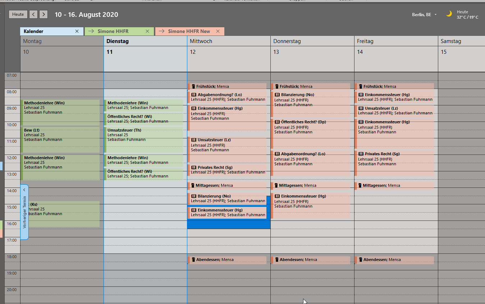
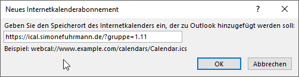
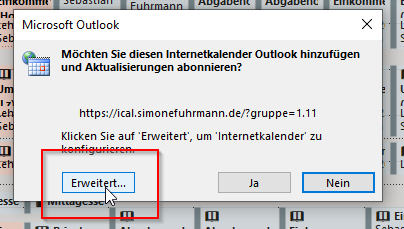
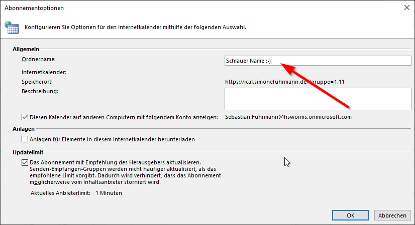

## Allgemeines
---
**HINWEIS**
Dieses Projekt steht in keinerlei Verbindung mit dem Studienzentrum Rotenburg an der Fulda.  

---

Dieses Repository enthält im Wesentlichen zwei Skripte zum Importieren und Verarbeiten der vom Studienzentrum Rothenburg (Fulda) zur Verfügung gestellten PDF-Stundenpläne. 

- [importPlan.php](importPlan.php) ruft ```pdf2htmlEX``` auf, um einen PDF-Stundenplan in HTML zu konvertieren und im Anschluss zu verarbeiten
- [index.php](index.php) ruft die dadurch gewonnen Daten (zusammen mit einigen META-Informationen wie Verpflegungsplan und Standard-Räume) aus einer Datenbank ab und erzeugt daraus ein iCal-File, welches von Microsoft Outlook, Google Calendar oder Apple Calender abonniert werden kann. 

## Aktuelles Setup
Datenbank und iCal-Dienst werden zurzeit auf Server im Internet betrieben. Der iCal-Kalender kann von jedem frei verfügbar abonniert werden - die Daten (Dozenten sowie Räume) werden hier allerdings anonymisiert. Nur für authentifizierte Nutzer (bitte anfragen) steht eine vollständige, nicht-anonymisierte Version zur Verfügung. 

Der Import der Stundenplan-PDFs erfolgt aktuell über interne Server der Familie Fuhrmann/des Rechenzentrum Fuhrmann. 



### iCal-Kalender abonnieren
Der iCal-Dienst steht zurzeit unter folgender URL zur Verfügung:
```https://ical.simonefuhrmann.de/?gruppe=1.11```
Dabei sollte ```1.11``` unbedingt durch die eigene Gruppenbezeichnung ersetzt werden. Wird anstelle einer Gruppenbezeichnung ```all``` eingesetzt, werden die Stundenpläne aller Gruppen abonniert. 

#### iOS-Geräte
- Geräte-Einstellungen öffnen
- Passwort & Accounts
- Add Account / Account hinzufügen
- Other / Anderer Account
- Add Subcribed Calender / Kalenderabo hinzufügen
- Bei Server obige URL eingeben
- Name beliebig setzen
- Abspeichern - fertig. :) 

[Video: iOS-Einstellungen](assets/iossettings.mp4)


### Microsoft Outlook
- Kalender öffnen
- "Aus dem Internet..." > URL eingeben > OK
- "Erweitert" > Sinnvollen Namen geben
- "OK" > "Ja"
- Fertig :) 



